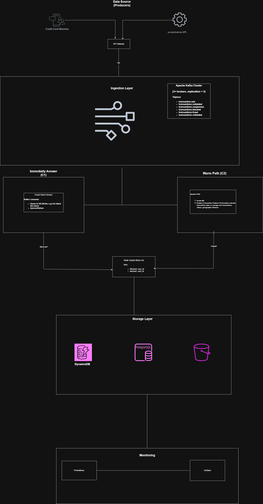
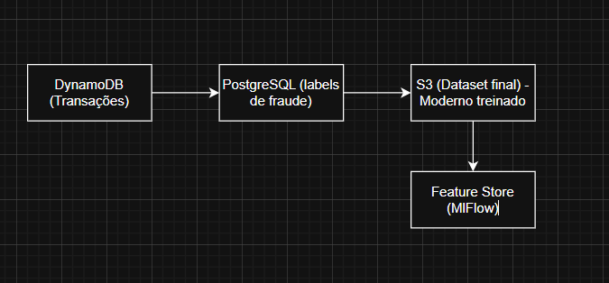
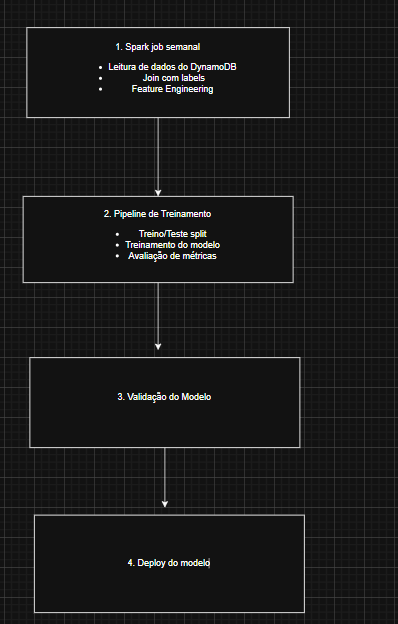

# Kafka Delivery System

## 1 - Diagrama da Arquiterua

## 2 - Casos de uso

Na primeira camada da aplicação, Data Source, temos as máquinas de cartão de crédito (maquininhas) e APIs de e-commerce como produtores de mensagens. Ambas as aplicações enviam, para um API Gateway, suas respectivas transações de cartão que, por sua vez, enviará para um cluster Kafka, que é camada de ingestão de dados.

No cluster Kafka, teremos pelo menos 3 brokers com um nível de replicação também igual à 3. Neste cluster, serão criados 5 tópicos diferentes: raw, validated, suspicious, blocked e fraud.

Seguindo teremos dois consumers, C1 e C2, nos quais o primeiro fará uma verificação imediata da transação e o segundo um Warm Path para detectação do status da transação através do modelo de Machine Learning (ML).

### Caso de uso 1: Transação Legítima

POS/API → API Gateway → Kafka [transactions.raw]
  → Fraud Check Service consulta Redis → user_id/card_id/localidade NÃO estão em blocklist
  → Publica em Kafka [transactions.validated]
  → Consumer enriquece transação com dados do PostgreSQL
  → Modelo ML atribui score (transação legítima)
  → Armazena em DynamoDB com retention period de 180 dias

### Caso de uso 2: Transação suspeita detectada pelo ML

Flink consome [transactions.validated]

 → Feature engineering (velocidade de gastos, distância geográfica,
     valor vs média do usuário, categoria do site vs histórico)
  → Modelo ML retorna score > threshold
  → Publica em Kafka [transactions.suspicious]
  → Consumer atualiza Redis: adiciona user_id/card_id à blocklist
  → Armazena em Cassandra tabela suspicious_transactions
  → Alerta para equipe de análise de fraude (via webhook/email)

### Caso de uso 3: Confirmação de Fraude (Analista confirma)
Analista de fraude revisa transação suspeita no dashboard
  → Confirma: é fraude
  → API interna publica em Kafka [transactions.fraud]
  → Consumer mantém blocklist no Redis (user/card/site permanecem bloqueados)
  → PostgreSQL: insere registro em fraud_cases (para auditoria e retreino)
  → Dados fluem para S3/Data Lake como labeled data para retreino do modelo

### Caso de uso 4: Transação de Usuário/Cartão/Site Bloqueado

POS/API → API Gateway → Kafka [transactions.raw]
  → Fraud Check Service consulta Redis → user_id ESTÁ em blocked:users
  → Publica em Kafka [transactions.blocked] → Resposta: BLOQUEADA
  → Transação armazenada no Cassandra com flag is_blocked=true
  → Notificação enviada ao time de fraude

## 3. Escolha das tecnologias
#### Apache Kafka -> Throughoput de 10K por segundo é trivial para o Kafka. Particionamento por card_id garante a ordenação por cartão. A replicação = 3 elimina o SPOF.
#### Apache Flink -> Processamento stateful de streams em janelas temporais
#### DynamoDB -> Um ótimo banco de dados para o nível de Throughoput exigido, pois ele é write-heavy. Podendo particionar por card_id e pelo timestamp, além de possuir um TTL nativo de 180 dias;
#### Prometheus + Grafana -> Stack padrão para observability, métricas de negócio e infra juntas, além de possuir alertas extremamente configuráveis
#### PostgreSQL -> Usado para dados dimensionais (como os dados dos usuários, sites, etc). No formato de Read-replicas, disponibilizado pelos serviços da AWS, garante uma boa capacidade de leitura para o Apache Flink
#### S3 -> Armazenamento distribuído, e barato. Ideal para reter dados históricos de treinamento. Utilizando-se de arquivos no formato coluna, como o Parquet, otimiza-se consultas analíticas. Além disso, também possui integração nativa com Spark/Flink

## 4. Machine Learning

### 4.1 Coleta de dados

Fontes de dados para treino:
- Transações históricas do DynamoDB (180 dias)
- Labels do PostgreSQL (fraud_cases: confirmed fraud + false positives)
- Dados enriquecidos: user profile, site category, geolocalização

### 4.2 Fluxo de treinamento

## 5. Garantia de não SPOF

Apache Kafka -> replication.factor = 3, min.insync.replicas=2. 
Redis -> Redis com pelo menos 3 masters + 3 réplicas
PostgreSQL -> Read replicas + MultiAZ
DynamoDB -> replication_factor=3
Apache Flink -> Cluster com multiplos TaskManagers

## 6. Monitoramento

### 6.1 Métricas de sistema
- CPU/Memória dos Serviços
- Nível de disco dos brokers do Kafka
- Memória usada no Redis

### 6.2 Métricas de Negócio
- Transações por segundo
- Blocklist size
- Taxa de falsos positivos
- Taxa de falsos negativos