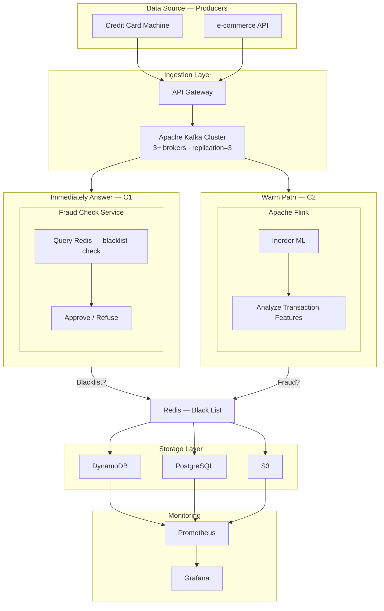

```mermaid
flowchart TD
    subgraph Producers["Data Source — Producers"]
        CCM["Credit Card Machine"]
        EAPI["e-commerce API"]
    end

    CCM --> GW["API Gateway"]
    EAPI --> GW

    subgraph Ingestion["Ingestion Layer"]
        GW --> KAFKA["Apache Kafka Cluster\n3+ brokers · replication=3"]
    end

    KAFKA --> C1
    KAFKA --> C2

    subgraph C1["Immediately Answer — C1"]
        subgraph FCS["Fraud Check Service"]
            BLC["Query Redis — blacklist check"]
            AR["Approve / Refuse"]
            BLC --> AR
        end
    end

    subgraph C2["Warm Path — C2"]
        subgraph FLINK["Apache Flink"]
            ML["Inorder ML"]
            ATF["Analyze Transaction Features"]
            ML --> ATF
        end
    end

    C1 -- "Blacklist?" --> REDIS["Redis — Black List"]
    C2 -- "Fraud?" --> REDIS

    subgraph Storage["Storage Layer"]
        DDB["DynamoDB"]
        PG["PostgreSQL"]
        S3["S3"]
    end

    REDIS --> DDB
    REDIS --> PG
    REDIS --> S3

    subgraph Mon["Monitoring"]
        PROM["Prometheus"] --> GRAF["Grafana"]
    end

    DDB --> PROM
    PG --> PROM
    S3 --> PROM
```