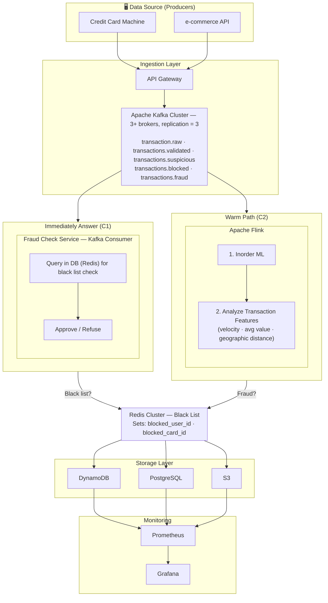

```mermaid
flowchart TD
    subgraph Producers["🖥️ Data Source (Producers)"]
        CCM["Credit Card Machine"]
        EAPI["e-commerce API"]
    end

    CCM --> APIGW["API Gateway"]
    EAPI --> APIGW

    subgraph Ingestion["Ingestion Layer"]
        APIGW --> KAFKA
        subgraph KAFKA["Apache Kafka Cluster — 3+ brokers, replication = 3\n\ntransaction.raw · transactions.validated · transactions.suspicious\ntransactions.blocked · transactions.fraud"]
        end
    end

    KAFKA --> C1
    KAFKA --> C2

    subgraph C1["Immediately Answer (C1)"]
        subgraph FCS["Fraud Check Service — Kafka Consumer"]
            BLC["Query in DB (Redis) for black list check"]
            AR["Approve / Refuse"]
            BLC --> AR
        end
    end

    subgraph C2["Warm Path (C2)"]
        subgraph FLINK["Apache Flink"]
            ML["1. Inorder ML"]
            ATF["2. Analyze Transaction Features\n(velocity · avg value · geographic distance)"]
            ML --> ATF
        end
    end

    subgraph REDIS["Redis Cluster — Black List\nSets: blocked_user_id · blocked_card_id"]
    end

    C1 -- "Black list?" --> REDIS
    C2 -- "Fraud?" --> REDIS

    subgraph Storage["Storage Layer"]
        DDB["DynamoDB"]
        PG["PostgreSQL"]
        S3["S3"]
    end

    REDIS --> DDB
    REDIS --> PG
    REDIS --> S3

    subgraph Monitoring["Monitoring"]
        PROM["Prometheus"]
        GRAF["Grafana"]
    end

    DDB --> PROM
    PG --> PROM
    S3 --> PROM
    PROM --> GRAF

```