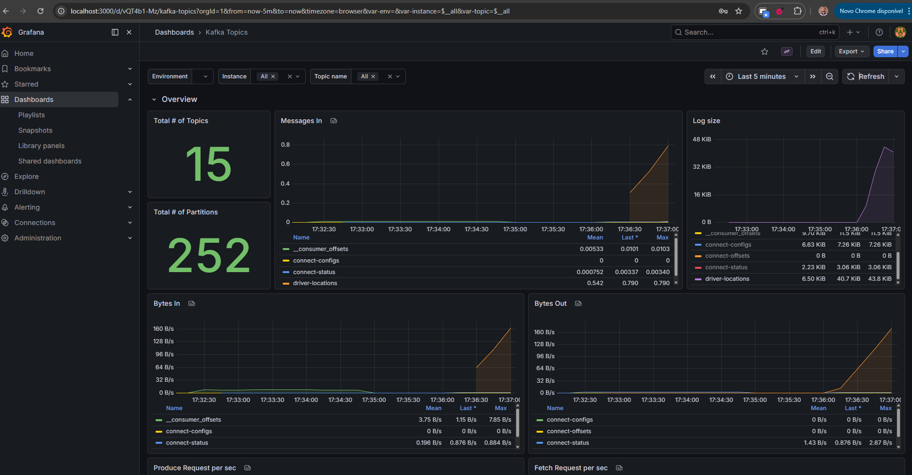
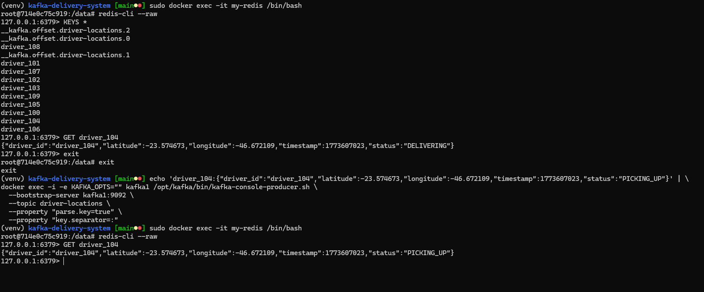

# 1. Topologia do ambiente
Arquivo docker-compose.yml contendo os seguintes recursos: 
    - Cluster Kafka com 3 Brokers
    - Redis
    - Kafka Connect
    - PostgreSQL
    - Grafana 
    - Prometheus
# 2. Configuração dos tópicos

Após a execução do arquivo docker contendo todos os serviços necessários, é hora de criarmos o tópico que será usado no projeto. O tópico em questão se chamará driver-locations.
	Para isso, devemos executar o script


```bash
docker exec -e KAFKA_OPTS=""  kafka1 /opt/kafka/bin/kafka-topics.sh --create \
  --bootstrap-server kafka1:9092 \
  --topic driver-locations \
  --partitions 3 \
  --replication-factor 3 \
  --config cleanup.policy=compact \
  --config compression.type=snappy \
  --config min.cleanable.dirty.ratio=0.01 \
  --config segment.ms=10000 \
  --config delete.retention.ms=100

```
O código em questão entra no container kafka1 e executa o script bash kafka-topics com o parâmetro –create, o nível de partição 3, replication-factor de 3. Automaticamente, o mesmo tópico será criado nos outros brokers, kafka2 e kafka3. 


Para listar os tópicos, pasta executar
```bash
docker exec -e KAFKA_OPTS="" kafka1 /opt/kafka/bin/kafka-topics.sh --list --bootstrap-server kafka1:9092

```


# 3. Configuração do Conector
Com isto, o nosso cluster kafka pode ficar exposto à se conectar com os serviços. Um deles será o redis, banco de dados em memória que usaremos para guardar a localização (latitude e longitude) do sistema de delivery. Para tal, cria-se um arquivo chamado redis-sink-connect.json contendo os seguintes de chaves e valores

```bash
{
    "name": "redis-sink-driver-locations",
    "config": {
      "connector.class": "com.github.jcustenborder.kafka.connect.redis.RedisSinkConnector",
      "tasks.max": "3",
      "topics": "driver-locations",
      "redis.hosts": "my-redis:6379",
      "redis.database": "0",
      "key.converter": "org.apache.kafka.connect.storage.StringConverter",
      "value.converter": "org.apache.kafka.connect.storage.StringConverter",
      "redis.key.pattern": "driver:${topic}:${key}"
    }
  }

```
Após a criação do arquivo, fazemos uma chamada POST utilizando o curl e passando no body da requisição o conteúdo do arquivo. A execução será conforme abaixo

```bash
curl -X POST http://localhost:8083/connectors \
-H "Content-Type: application/json" \
-d @redis-sink-connector.json
```

# 4. Evidência do monitoramento


# 5. Validação de Estado
Rodando o script entraremos direto no container do redis

```bash
sudo docker exec -it my-redis /bin/bash
```

após isso, executamos 
```bash
redis-cli --raw
```

Para listar, então, as keys existentes, basta executarmos
```bash
KEYS *
```

se usarmos o driver_104 como exemplo e observamos o status atual, o resultado de que o seu status atual é "DELIVERING"

```bash
GET driver_104
```

após isso, se alteramos manulamente o status para "PICKING_UP", vamos perceber que o redis foi atualizado com sucesso, conforme o print abaixo



